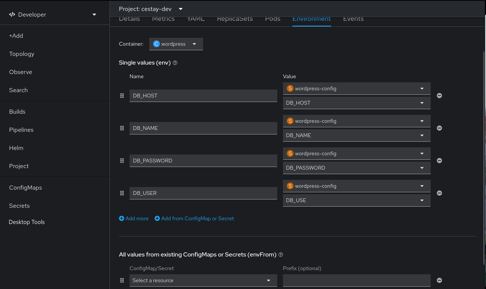

# Demo despliegue de Wordpress

### Variables utiles 
```
export OPENSHIFT_USER=
```

### Crear base de datos mariadb para wordpress
```
oc new-app mariadb-ephemeral
```
obtendras una salida similar a la que esta a continuación, guardar credenciales
```
...
Username: userVNI
Password: 0QmkBB0LB2CRyn6L
Database Name: sampledb
Connection URL: mysql://mariadb:3306/
...
```

### Crear app wordpress
#### app vacia, se debe configurar desde cero

```
oc new-app php~https://github.com/wordpress/wordpress
```
#### wordpress with config, utilizar esta estrategia si ya se instalo previamente y cuenta con el esquema de wp en la base de datos

```
export DB_NAME=
```
```
export DB_USER=
```
```
export DB_PASSWORD=
```
```
export DB_HOST=
```
```
oc create secret generic wordpress-config --from-literal=DB_NAME=$DB_NAME --from-literal=DB_USER=$DB_USER --from-literal=DB_PASSWORD=$DB_PASSWORD --from-literal=DB_HOST=$DB_HOST
```
```
oc new-app php~https://github.com/pkstaz/demo-application-deployment --context-dir=apps/wordpress/base --name wordpress
```

### Link secret to deploy in deployment details



# Extras

### Obtener URL del Registry Publico de la imagen wordpress que se creo recientemente
```
OCP_REGISTRY_URL=$(oc get is wordpress -o jsonpath='{.status.publicDockerImageRepository}') 
```

### Login en Registry de Openshift
```
podman login \
    ${OCP_REGISTRY_URL} \
    --username %OPENSHIFT_USER% \
    --password "$(oc whoami -t)" 
```


# Clean Demo
### delete wordpress workload
```
oc delete is wordpress
oc delete bc wordpress
oc delete deployment wordpress
oc delete svc wordpress
```

### delete db
```
oc delete dc mariadb
oc delete svc mariadb
oc delete secret mariadb
```
